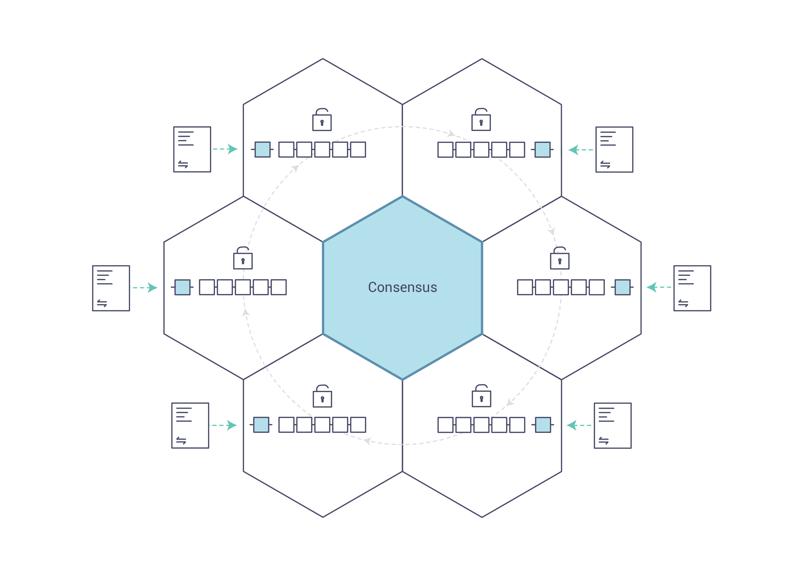

Introduction
============

Hyperledger Fabric是分布式账本解决方案的平台，采用模块化架构来提供高度机密性，伸缩性，灵活性和可扩展性。
它旨在支持不同组件的可插拔实现，并适应整个经济生态系统中存在的复杂性和复杂性。

我们建议首次使用的用户首先阅读下面的相关介绍，以便熟悉区块链的工作方式以及Hyperledger Fabric的特定功能和组件。

一旦感到合适了 - 或者您已经熟悉区块链和Hyperledger Fabric - 请转到 :doc:`getting_started`，
然后从那里探索demos，技术规范，API等。

What is a Blockchain?
---------------------
**分布式账本**

区块链的核心概念就是分布式账本，记录着发生在这个网络上的所有transactions。

区块链分类帐通常被描述为 **decentralized** 的，因为它被复制到许多网络参与者中，每个 **collaborate** 
都在维护中进行协作。我们会发现，分散化和协作化是反映了商业在现实世界中交换商品和服务的方式的强大属性。

.. image:: images/basic_network.png

除了分布式和协作外, 记录到 blockchain 的信息是只能追加的, 而且使用加密技术可以保证一旦将一个transaction添加到帐本中, 
就无法再修改它。这种 "不变性" 的属性使得确定信息的出处变得简单, 因为参与者可以确信信息在事实之后没有改变。
这就是为什么区块链有时被描述为 **存证系统** 的原因。

**Smart Contracts**

为了支持信息更新的一致性 - 并启用整个账本功能（交易，查询等） - 区块链网络使用智能合约来提供对账本的受控访问。

.. image:: images/Smart_Contract.png

智能合约不仅是封装信息并在整个网络中保持简单的关键机制，还可以编写它们以允许参与者自动执行交易的某些方面。

例如，可以编写智能合约以规定运输物品的成本，其中运费根据物品到达的速度而变化。根据双方同意并写入规则到账本中，
当收到物品时，那么根据规则适当的资金就会自动转移。

**Consensus**

为了保持分类账交易在整个网络中同步的过程 - 确保分类账仅在交易被相应参与者批准时更新，并且当分类账更新时，
它们以相同的顺序更新相同的transactions - 称为 **共识**

稍后您将学习更多关于账本，智能合约和共识的知识。就目前而言，将区块链视为共享的复制交易系统就足够了，
该系统通过智能合约进行更新，并通过称为共识的协作流程保持一致。

Why is a Blockchain useful?
---------------------------

**Today’s Systems of Record**

今天的transactional网络只不过是自业务记录保存以来存在的网络的稍微更新的版本。
 **business network**的成员彼此之间进行交易，但他们维护各自transactions的单独记录。
 他们所交易的东西-无论是16世纪的佛兰德挂毯，还是今天的证券-必须在每次出售时都需要经过一系列的验证来确保销售
 这件物品的企业拥有该东西的所有权

留下的就是这样的网络拓扑结构:

.. image:: images/current_network.png

现代技术把这个过程从石片和纸夹到硬盘驱动器和云平台, 但底层结构是相同的。统一的网络参与者身份管理系统不存在, 
建立溯源信息非常费力, 需要几天时间来清除证券交易 (世界交易量的数量在许多万亿美元), 合同必须签署并手动执行, 
并且系统中的每个数据库都包含唯一的信息, 因此单故障容错性。

即使可见性和信任的需求很明显，今天的信息和流程共享方法也不可能构建一个跨越业务网络的记录系统。

**The Blockchain Difference**

假如商业网络有了在网络上建立身份、执行交易和存储数据的标准方法，那么是否可以替换“现代”交易系统所代表的低效巢？
如果建立一个资产的来源，一旦被写入，不能被改变，只能通过查阅一系列的transactions来获取信息，那么是否就可以被信任？

如此网络拓扑结构就会如下：

.. image:: images/future_net.png
 
这就是区块链网络，网络中的每一个参与者都会有账本的副本。除了共享账本信心外，对账本的操作也是共享的。不像现有系统的
私有程序控制私有账本，区块链系统使用 共享程序 操作共享账本。

通过共享分类账协调其业务网络的能力，区块链网络可以减少与私人信息和处理相关的时间，成本和风险，同时提高信任和可见性。

至此您应该知道区块链是什么以及为什么它有用。 当然还有许多重要的其他细节，但它们都与信息和流程共享的这些基本思想有关。

What is Hyperledger Fabric?
---------------------------

Linux基金会在2015年创建了Hyperledger项目，以推进跨行业的区块链技术。
它不是宣布单一的区块链标准，而是鼓励通过社区进程合作开发区块链技术，并拥有鼓励开放开发和长期采用关键标准的知识产权。

Hyperledger Fabric是Hyperledger中的区块链项目之一。 与其他区块链技术一样，它有一个账本，使用智能合约，
是参与者管理交易的系统。

Hyperledger Fabric与其它区块链系统不同之处在于它是 **private** 和 **permissioned**的。Hyperledger Fabric
网络的成员通过可信赖的 **会员服务提供商（MSP）** 注册，而不是允许未知身份参与网络的开放式无权限系统
（需要诸如“工作证明”之类的协议来验证交易并保护网络）。

Hyperledger Fabric还提供了几种可插拔的选项。
Ledger数据可以多种格式存储，可以交换共识机制，支持不同的MSP。

Hyperledger Fabric还提供了创建 **channels** 的能力，允许一组参与者创建一个单独的transactions 账本。
对于网络来说，这是一个特别重要的选择，因为有些参与者可能是竞争对手，而不是希望他们所做的每一笔交易（譬如他们提供给一些参与者、而不是其他参与者的特别价格）
都是每个参与者都知道的。如果两个参与者组成了一个通道，那么这些参与者都有该频道分类账的副本，其他参与者则没有。

**Shared Ledger**

Hyperledger Fabric有一个账本子系统，包括两个组件：**world
state** 和 **transaction log**。 每个参与者都拥有他们所属的每个Hyperledger Fabric网络的账本副本。

世界状态组件描述了在给定时间点的账本的状态。它是账本的数据库。transaction日志组件记录导致世界状态当前值的所有transaction; 
这是世界状态的更新历史。然后，账本是世界状态数据库和事务日志历史记录的组合。

账本具有可替换的数据库来存储世界状态数据。默认情况下，采用LevelDB键值存储数据库。
事务日志不需要是可插拔的。它只记录区块链网络使用的分类帐数据库的前后值。

**Smart Contracts**

Hyperledger Fabric智能合约以 **chaincode** 编写，当该应用程序需要与账本交互时，由区块链外部的应用程序调用。
在大多数情况下，chaincode只与账本的数据库组件，世界状态（例如，查询它）交互，而不与事务日志交互。

chaincode可以采用多种编程语言进行编写。目前支持的是Go和Node。

**Privacy**

根据网络的需求，企业对企业（B2B）网络中的参与者可能对他们共享的信息量非常敏感。对于其他网络，隐私不是最受关注的问题。

相对于开放的网络Hyperledger Fabric支持隐私（使用channels）是关键属性。

**Consensus**

交易必须按照发生的顺序写入账本中，即使它们可能位于网络中不同的参与者组之间。为此，必须建立transactions的顺序，
并且必须采用一种方法来拒绝错误（或恶意）插入到分类帐中的错误transactions。

这是一个彻底研究的计算机科学领域，有很多方法可以实现它，每个方法都有不同的权衡。
例如，PBFT（Practical Byzantine Fault Tolerance）可以为文件副本提供一种机制，使其能够保持每个副本的一致性，即使在发生损坏的情况下也是如此。
或者，在比特币中，通过称为挖掘的过程进行排序，其中竞争计算机竞争解决加密难题，该难题定义所有过程随后构建的顺序。

Hyperledger Fabric旨在允许网络启动者选择最能代表参与者之间存在的关系的共识机制。
与隐私一样，有一系列需求; 从在他们的关系中高度结构化的网络到更加p2p的网络。

我们将了解有关Hyperledger Fabric共识机制的更多信息，目前包括SOLO和Kafka。

Where can I learn more?
-----------------------

* `Identity <identity/identity.html>`_ (conceptual documentation)

A conceptual doc that will take you through the critical role identities play
in a Fabric network (using an established PKI structure and x.509 certificates).

* `Membership <membership/membership.html>`_ (conceptual documentation)

Talks through the role of a Membership Service Provider (MSP), which converts
identities into roles in a Fabric network.

* `Peers <peers/peers.html>`_ (conceptual documentation)

Peers --- owned by organizations --- host the ledger and smart contracts and make
up the physical structure of a Fabric network.

* :doc:`build_network` (tutorial)

Learn how to download Fabric binaries and bootstrap your own sample network with
a sample script. Then tear down the network and learn how it was constructed one
step at a time.

* :doc:`write_first_app` (tutorial)

Deploys a very simple network --- even simpler than Build Your First Network ---
to use with a simple smart contract and application.

* :doc:`txflow`

A high level look look at a sample transaction flow.

* :doc:`fabric_model`

A high level look at some of components and concepts brought up in this introduction as
well as a few others and describes how they work together in a sample
transaction flow.

.. Licensed under Creative Commons Attribution 4.0 International License
   https://creativecommons.org/licenses/by/4.0/
